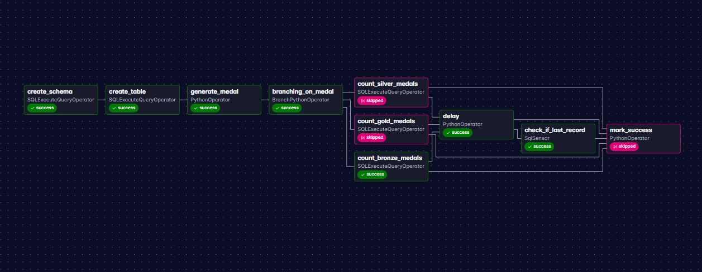
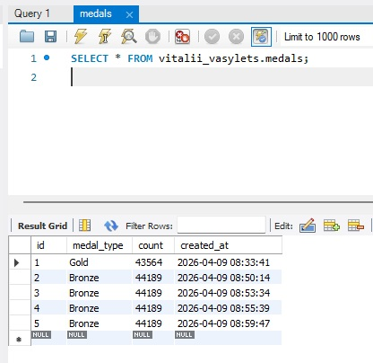
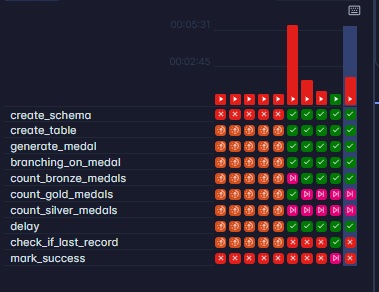

# goit-de-hw-07

Результат виконання домашнього завдання goit-de-hw-07 DAG-файлу
vitalii_vasylets_de_hw7_dag.py у Apache Airflow локально піднятому за допомогою
Docker:

- Виконані пункти:

1. Створення таблиці .
2. Генерація випадкового значення.
3. Розгалуження: запуск одного із трьох завдань залежно від обраного значення.
4. Виконання завдань з рахування кількість записів у таблиці.
5. Реалізація затримки виконання наступного завдання.
6. Перевірка, чи найновіший запис у таблиці не старший за 30 секунд.

- проведено 5 успішних запусків із записом до бази даних, з котрих 1 з успішною
  перевіркою запису не старіше 30 секунд, 4 з неуспішною.
- У базі даних наявні 5 записів від 5 успішних запусків.
